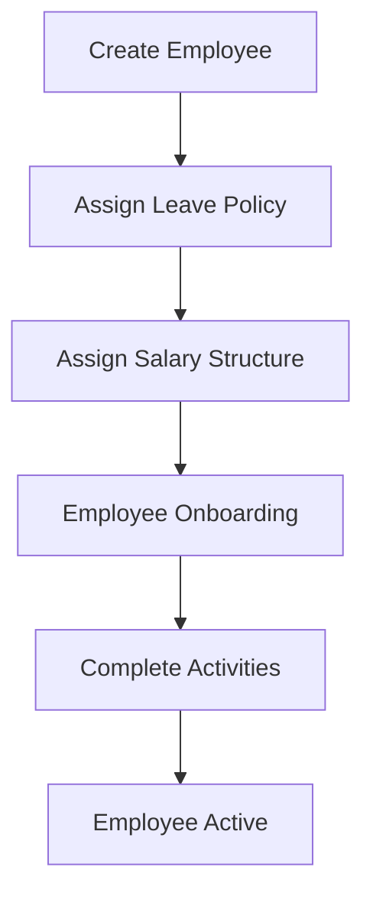
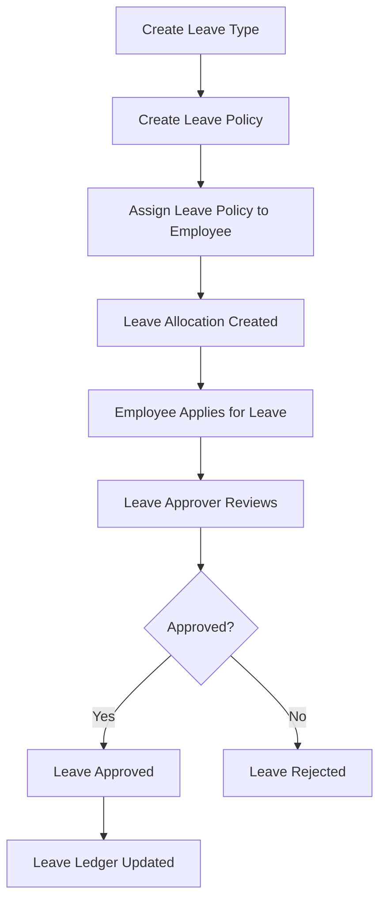
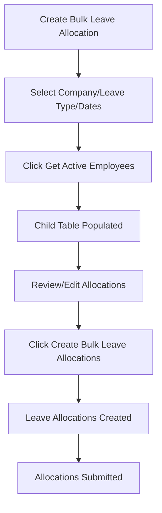
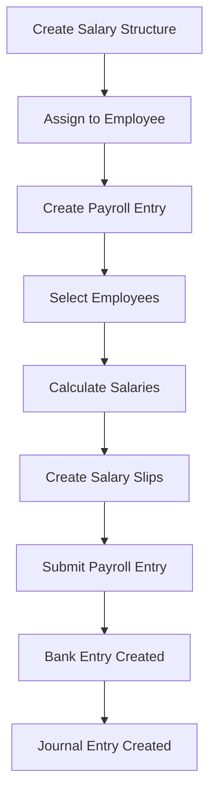
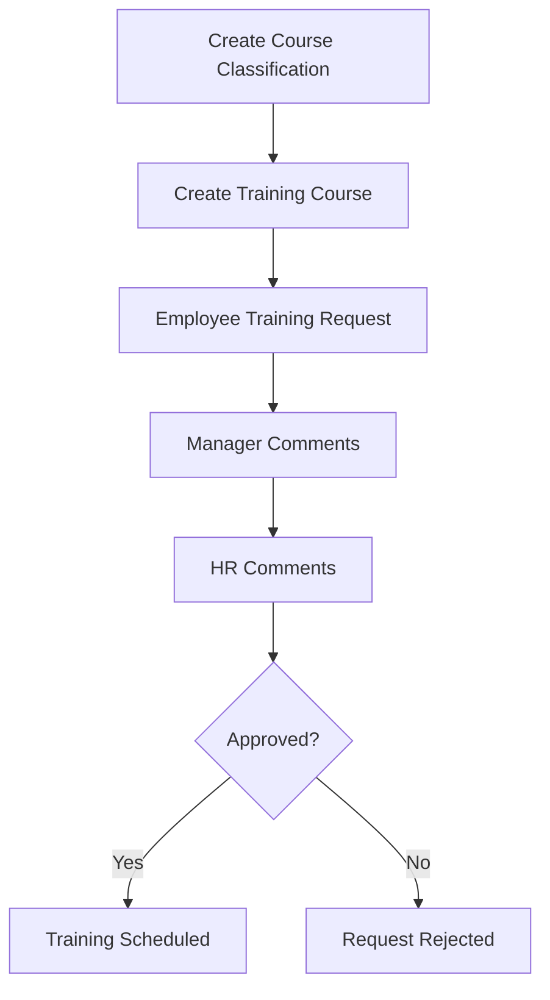
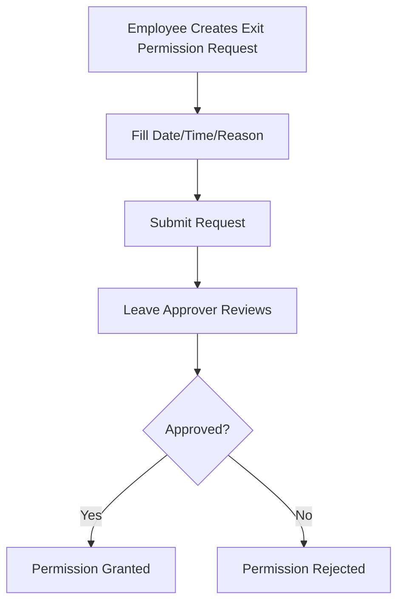

# Workflow

## Overview

Simple workflow diagrams for hr_advance app processes.

## Main Workflows

### Employee Onboarding

### Leave Management

### Bulk Leave Allocation

### Payroll Processing

### Training Management

### Exit Permission

## DocType Relationships

### Leave Management

-   Leave Type → Leave Policy → Leave Policy Assignment → Leave Allocation → Leave Application

### Payroll

-   Salary Component → Salary Structure → Salary Structure Assignment → Payroll Entry → Salary Slip

### Employee Management

-   Employee → Leave Policy Assignment → Leave Allocation
-   Employee → Salary Structure Assignment → Payroll Entry
-   Employee → Employee Onboarding → Employee Active

## Key Processes

1. **Leave Allocation**: Automatic via Leave Policy Assignment or Manual via Bulk Leave Allocation
2. **Payroll**: Monthly/Weekly processing via Payroll Entry
3. **Training**: Request-based workflow with approvals
4. **Exit Permission**: Time-based permission requests
