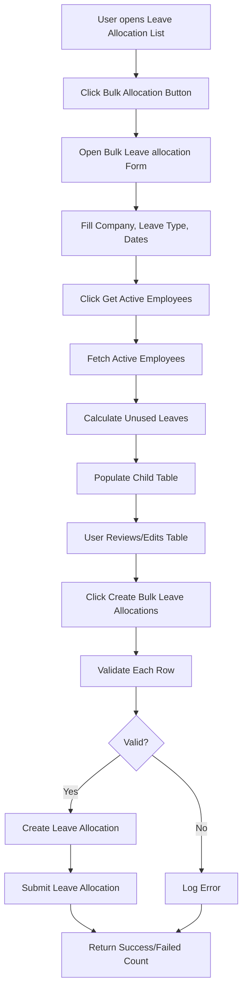
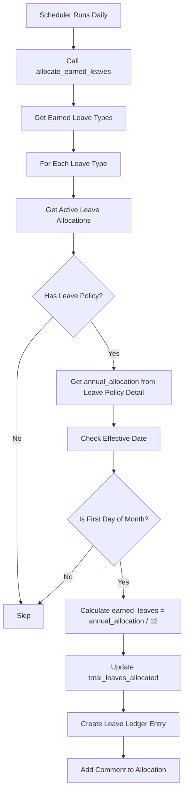
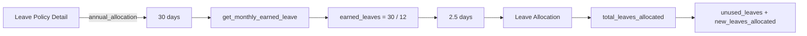
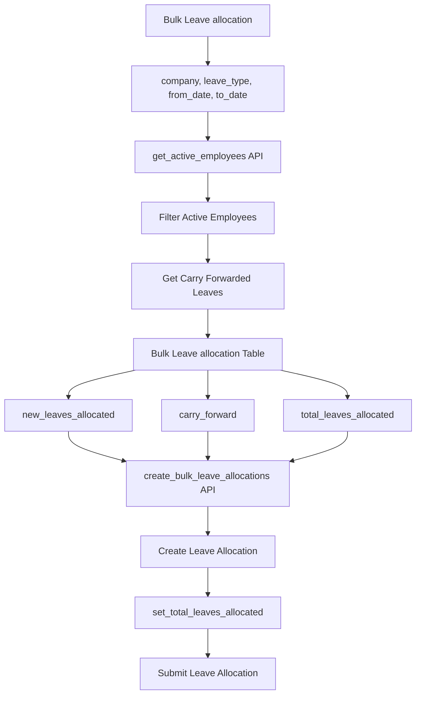
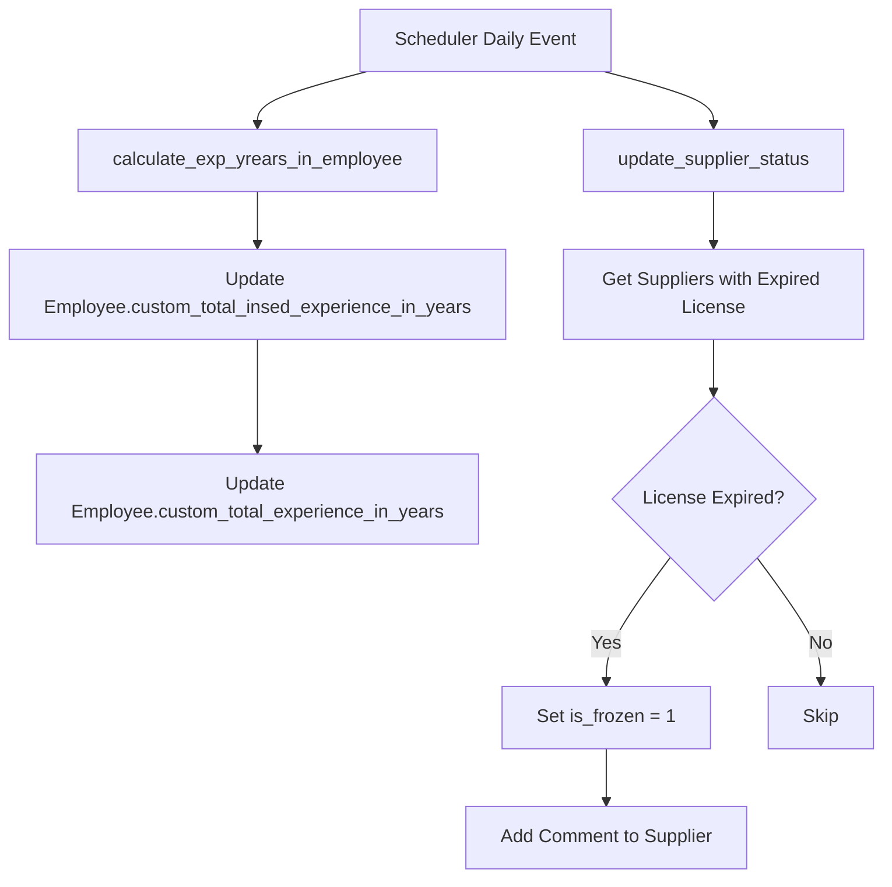
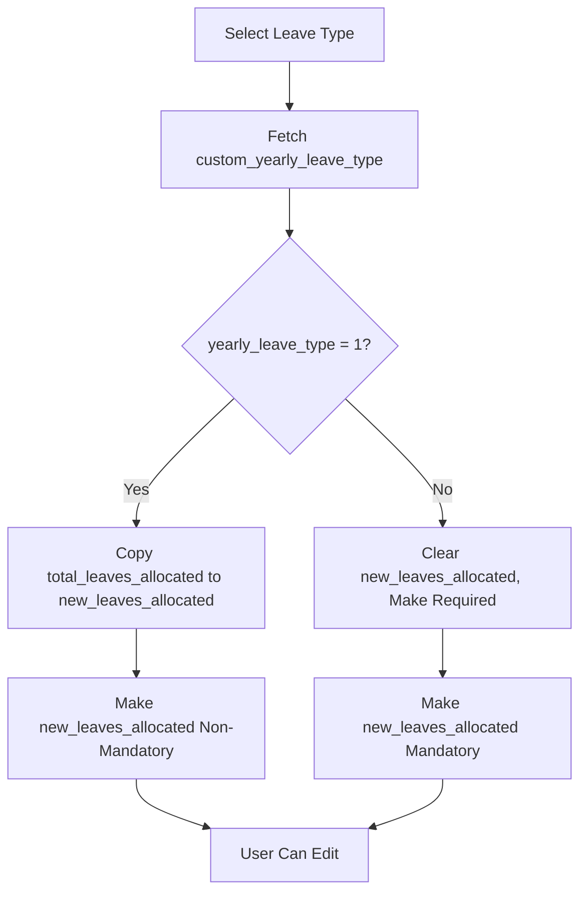

# HR Advance - Workflow Diagrams

## Overview

Simple workflow documentation for hr_advance app processes.

## 1. Bulk Leave Allocation Workflow

## 2. Earned Leaves Allocation Workflow (HRMS)

## 3. Leave Allocation Field Flow

## 4. Bulk Leave Allocation Data Flow

## 5. Scheduled Tasks Workflow

## 6. Yearly Leave Type Logic

